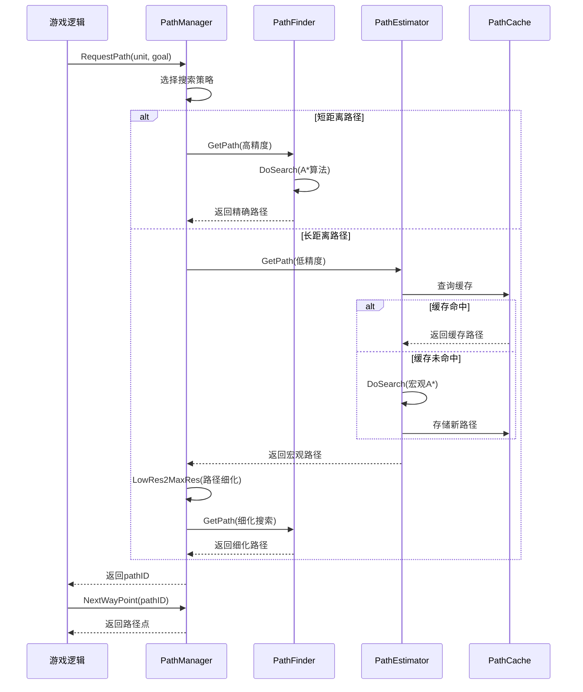

# 系统架构与接口设计

## 目录

1. [系统架构概览](#1-系统架构概览)
2. [核心接口设计](#2-核心接口设计)
3. [类继承关系](#3-类继承关系)
4. [组件交互模式](#4-组件交互模式)
5. [线程模型](#5-线程模型)
6. [扩展机制](#6-扩展机制)

---

## 1. 系统架构概览

### 1.1 分层架构图

```
┌─────────────────────────────────────────────────────────┐
│                    游戏逻辑层                            │
│  (Unit Movement, Command AI, Strategic Planning)        │
└─────────────────────┬───────────────────────────────────┘
                      │ RequestPath()
                      │ NextWaypoint()  
                      │ DeletePath()
┌─────────────────────▼───────────────────────────────────┐
│                   接口抽象层                             │
│  IPathManager, IPathController, IPathFinder            │
└─────────────────────┬───────────────────────────────────┘
                      │
┌─────────────────────▼───────────────────────────────────┐
│                 HAPFS核心层                             │
│                                                         │
│  ┌───────────────┐ ┌──────────────┐ ┌────────────────┐  │
│  │ PathManager   │ │ PathFinder   │ │PathEstimator   │  │
│  │   (调度器)     │ │  (高精度)    │ │   (宏观)       │  │
│  └───────────────┘ └──────────────┘ └────────────────┘  │
│                                                         │
│  ┌───────────────┐ ┌──────────────┐ ┌────────────────┐  │
│  │  PathCache    │ │ PathHeatMap  │ │ PathFlowMap    │  │
│  │   (缓存)      │ │   (热力图)    │ │   (流场)       │  │
│  └───────────────┘ └──────────────┘ └────────────────┘  │
└─────────────────────┬───────────────────────────────────┘
                      │
┌─────────────────────▼───────────────────────────────────┐
│                   数据存储层                             │
│  PathNodeBuffer, PathCache Files, PathingState         │
└─────────────────────────────────────────────────────────┘
```

### 1.2 数据流向

```
路径请求 → PathManager → 分层选择 → PathEstimator/PathFinder
    ↓
预计算检查 → PathCache → 缓存命中？
    ↓                      ↓
   否                     是
    ↓                      ↓
A*搜索 → 热力图/流场影响 → 返回缓存路径
    ↓
路径生成 → 路径平滑 → 缓存存储 → 返回给调用者
```

### 1.3 模块职责分工

| 模块 | 职责 | 输入 | 输出 |
|------|------|------|------|
| **PathManager** | 中央调度、分层选择 | 路径请求 | MultiPath |
| **PathFinder** | 高精度A*搜索 | 详细搜索参数 | 精确路径 |
| **PathEstimator** | 宏观块搜索 | 宏观搜索参数 | 宏观路径 |
| **PathCache** | 路径缓存管理 | 搜索参数 | 缓存路径(可选) |
| **PathHeatMap** | 拥堵避免 | 路径使用统计 | 额外成本 |
| **PathFlowMap** | 流场计算 | 单位移动向量 | 流向引导 |

---

## 2. 核心接口设计

### 2.1 IPathManager 接口

**文件位置**: `rts/Sim/Path/IPathManager.h`

这是HAPFS系统对外的统一接口，支持插件式寻路系统：

```cpp
class IPathManager {
public:
    // === 工厂方法 ===
    static IPathManager* GetInstance(int type);
    static void FreeInstance(IPathManager* pm);
    
    // === 生命周期管理 ===
    virtual bool Init(unsigned int numThreads) { return true; }
    virtual void Kill() {}
    virtual void Update() {}
    
    // === 核心寻路接口 ===
    virtual unsigned int RequestPath(
        CSolidObject* caller,    // 请求单位
        const MoveDef* moveDef,  // 移动定义
        float3 startPos,         // 起始位置
        float3 goalPos,          // 目标位置
        float goalRadius = 8.0f, // 目标半径
        bool synced = true,      // 同步标志
        bool immediate = false   // 立即处理标志
    ) = 0;
    
    virtual float3 NextWayPoint(
        const CSolidObject* owner, // 单位
        unsigned int pathID,       // 路径ID
        unsigned int numRetries,   // 重试次数
        float3 callerPos,          // 当前位置
        float radius,              // 单位半径
        bool synced                // 同步标志
    ) = 0;
    
    virtual void DeletePath(unsigned int pathID, bool force = false) = 0;
    
    // === 路径状态查询 ===
    virtual bool PathUpdated(unsigned int pathID) { return false; }
    virtual void ClearPathUpdated(unsigned int pathID) {}
    virtual bool AllowDirectionalPathing() { return false; }
    
    // === 地形变化处理 ===
    virtual void TerrainChange(unsigned int x1, unsigned int z1, 
                              unsigned int x2, unsigned int z2, 
                              unsigned int type) {}
    
    // === 路径控制 ===
    virtual void SetTempGoalPosition(unsigned int pathID, const float3& pos) {}
    virtual void SetRealGoalPosition(unsigned int pathID, const float3& pos) {}
    
    // === 成本修正 ===
    virtual void SetNodeExtraCost(unsigned int x, unsigned int z, 
                                 float cost, bool synced) {}
    virtual void SetNodeExtraCosts(const float* costs, unsigned int sizex, 
                                  unsigned int sizez, bool synced) {}
    virtual float GetNodeExtraCost(unsigned int x, unsigned int z, bool synced) const { return 0.0f; }
    
    // === 调试和监控 ===
    virtual uint32_t GetPathCheckSum() const { return 0; }
    virtual int2 GetNumQueuedUpdates() const { return int2(0, 0); }
    virtual void GetDetailedPathInfo(PathDetailedInfo& info) const {}
};
```

**寻路系统类型常量**:
```cpp
enum {
    NOPFS_TYPE = -1,  // 无寻路系统(编辑器模式)
    HAPFS_TYPE = 0,   // 分层A*寻路系统
    QTPFS_TYPE = 1,   // 四叉树寻路系统
    PFS_TYPE_MAX = 1
};
```

### 2.2 IPathController 接口

**文件位置**: `rts/Sim/Path/IPathController.h`

路径控制器接口，将高层路径规划与底层物理控制分离：

```cpp
class IPathController {
protected:
    CSolidObject* owner;  // 控制的单位

public:
    IPathController(CSolidObject* owner): owner(owner) {}
    virtual ~IPathController() {}
    
    // === 速度控制 ===
    virtual float GetDeltaSpeed(
        unsigned int pathID,     // 路径ID
        float targetSpeed,       // 目标速度
        float currentSpeed,      // 当前速度
        float maxAccRate,        // 最大加速度
        float maxDecRate,        // 最大减速度
        bool wantReverse,        // 想要倒车
        bool isReversing         // 正在倒车
    ) const = 0;
    
    // === 转向控制 ===  
    virtual short GetDeltaHeading(
        unsigned int pathID,     // 路径ID
        short newHeading,        // 新朝向
        short oldHeading,        // 当前朝向
        float maxTurnSpeed,      // 最大转向速度
        float maxTurnAccel,      // 最大转向加速度
        float turnBrakeDist,     // 转向刹车距离
        float* curTurnSpeed      // 当前转向速度(输出)
    ) const = 0;
    
    // === 目标管理 ===
    virtual void SetTempGoalPosition(unsigned int pathID, const float3& pos) = 0;
    virtual void SetRealGoalPosition(unsigned int pathID, const float3& pos) = 0;
    
    // === 碰撞处理 ===
    virtual bool IgnoreCollision(const CUnit* collider, const CUnit* collidee) const = 0;
    
    // === 状态查询 ===
    virtual bool IsPathReady(unsigned int pathID) const = 0;
};
```

### 2.3 IPathFinder 基础接口

**文件位置**: `rts/Sim/Path/HAPFS/IPathFinder.h`

所有寻路器的基础接口，定义了标准的搜索方法：

```cpp
class IPathFinder {
protected:
    // === 内存管理 ===
    PathNodeBuffer openBlockBuffer;        // 节点内存池
    PathNodeStateBuffer blockStates;       // 节点状态缓冲区  
    PathPriorityQueue openBlocks;          // 开放集优先队列
    
    // === 搜索统计 ===
    unsigned int mGoalBlockIdx;            // 目标块索引
    unsigned int testedBlocks;             // 已测试块数
    unsigned int badGoals;                 // 无效目标计数
    
    // === 线程安全 ===
    std::atomic<std::int64_t> offsetBlockNum;  // 偏移块编号
    std::atomic<std::int64_t> costBlockNum;    // 成本块编号

public:
    IPathFinder(unsigned int BSIZE);
    virtual ~IPathFinder();
    
    // === 核心搜索接口 ===
    IPath::SearchResult GetPath(
        const MoveDef& moveDef,              // 移动定义
        const CPathFinderDef& pfDef,         // 搜索定义
        const CSolidObject* owner,           // 所属单位
        float3 startPos,                     // 起始位置
        IPath::Path& path,                   // 输出路径
        unsigned int maxSearchedBlocks       // 最大搜索块数
    );
    
    // === 纯虚函数(子类必须实现) ===
    virtual IPath::SearchResult DoRawSearch(
        const MoveDef& moveDef, 
        const CPathFinderDef& pfDef,
        const CSolidObject* owner, 
        float3 startPos,
        IPath::Path& foundPath,
        unsigned int maxSearchedBlocks = 0) = 0;
    
    virtual IPath::SearchResult DoSearch(
        const MoveDef& moveDef,
        const CPathFinderDef& pfDef, 
        const CSolidObject* owner,
        float3 startPos,
        IPath::Path& foundPath,
        unsigned int maxSearchedBlocks = 0) = 0;
    
    virtual bool TestBlock(
        const MoveDef& moveDef,
        const CPathFinderDef& pfDef,
        const PathNode* parentBlockState,
        const CSolidObject* owner,
        const unsigned int pathOptDir,
        const unsigned int blockStatus,
        float speedMod) = 0;
    
    virtual void FinishSearch(
        const MoveDef& moveDef,
        const CPathFinderDef& pfDef,
        IPath::Path& foundPath) const = 0;
    
    virtual float GetHeuristic(
        const MoveDef& moveDef,
        const CPathFinderDef& pfDef, 
        const int2& square) const = 0;
    
    // === 状态查询 ===
    virtual std::uint32_t GetMemFootPrint() const { return 0; }
    const PathNodeStateBuffer* GetNodeStateBuffer() const { return &blockStates; }
};
```

---

## 3. 类继承关系

### 3.1 寻路器类层次结构

```
IPathFinder (抽象基类)
├── CPathFinder (高精度寻路器)
│   └── 实现1x1方格精度的A*搜索
│   └── 支持路径平滑和碰撞检测
│
└── CPathEstimator (宏观寻路器) 
    ├── 实现16x16或32x32块级搜索
    ├── 支持预计算和缓存
    └── 处理地形变化的增量更新
```

### 3.2 数据结构类层次

```
PathNode (搜索节点)
├── float fCost, gCost    // A*算法成本值
├── int nodeNum           // 一维节点索引  
├── ushort2 nodePos       // 二维坐标
└── bool exitOnly         // 仅允许离开标志

PathNodeStateBuffer (节点状态管理)
├── std::vector<float> fCost, gCost           // 成本数组
├── std::vector<uint8_t> nodeMask             // 状态位掩码
├── std::vector<uint8_t> nodeLinksObsoleteFlags // 连接过时标志
└── std::vector<float> extraCosts[2]          // 额外成本(同步/异步)

MultiPath (多层级路径)
├── IPath::Path lowResPath   // 低分辨率路径
├── IPath::Path medResPath   // 中分辨率路径  
├── IPath::Path maxResPath   // 高分辨率路径
├── IPath::SearchResult searchResult // 搜索结果
└── const MoveDef* moveDef   // 移动定义
```

### 3.3 接口实现关系

```cpp
// PathManager继承IPathManager  
class CPathManager : public IPathManager {
    // 实现所有虚接口
    unsigned int RequestPath(...) override;
    float3 NextWayPoint(...) override;
    void DeletePath(unsigned int pathID, bool force) override;
    // ... 其他接口实现
};

// PathController继承IPathController
class CPathController : public IPathController {
    // 实现控制逻辑
    float GetDeltaSpeed(...) const override;
    short GetDeltaHeading(...) const override;
    // ... 其他控制接口
};
```

---

## 4. 组件交互模式

### 4.1 同步交互流程



### 4.2 异步交互模式

HAPFS支持通过ECS系统进行异步路径处理：

```cpp
// 异步路径请求
void RequestAsyncPath() {
    // 创建ECS实体
    entt::entity pathEntity = HAPFS::registry.create();
    
    // 添加路径搜索组件
    HAPFS::registry.emplace<HAPFS::PathSearch>(pathEntity,
        caller, moveDef, startPos, goalPos, goalRadius, pathID);
}

// 批量处理(在PathManager::Update()中)
void ProcessAsyncRequests() {
    auto searchView = registry.view<PathSearch>();
    
    // 多线程并行处理
    for_mt(0, searchView.size(), [&](int idx) {
        auto entity = searchView[idx];
        auto& pathSearch = searchView.get<PathSearch>(entity);
        
        // 执行路径搜索
        MultiPath newPath = ArrangePath(&pathSearch);
        
        // 更新路径映射表
        UpdateMultiPathMT(pathSearch.pathID, newPath);
        
        // 清理ECS组件
        registry.destroy(entity);
    });
}
```

### 4.3 事件驱动模式

```cpp
// 地形变化事件
void OnTerrainChange(int x1, int z1, int x2, int z2) {
    // 1. 标记受影响的宏观块
    pathManager->TerrainChange(x1, z1, x2, z2, TERRAIN_CHANGE_DAMAGE);
    
    // 2. 系统自动响应
    // - PathingState标记需要更新的块
    // - PathCache使相关缓存失效
    // - PathEstimator在后续帧中重新计算成本
    // - 现有路径重新验证和可能的重新规划
}

// 路径完成事件  
void OnPathComplete(unsigned int pathID) {
    // 清理资源
    pathManager->DeletePath(pathID);
    
    // 通知单位继续下一个命令
    unit->commandAI->FinishCommand();
}
```

---

## 5. 线程模型

### 5.1 线程架构

```
主线程 (Game Thread)
├── 路径请求接收
├── 路径结果分发  
├── 地形变化处理
└── UI更新

工作线程池 (Worker Threads)
├── 并行路径搜索
├── 预计算数据更新
├── 缓存管理
└── 热力图更新
```

### 5.2 线程安全机制

#### 数据隔离策略
```cpp
// 每线程独立的寻路器实例
CPathFinder* pathFinders[MAX_THREADS * 3];  // 每线程3个分辨率级别
CPathEstimator* pathEstimators[MAX_THREADS * 2]; // 每线程2个分辨率级别

// 获取当前线程的寻路器
int threadNum = ThreadPool::GetThreadNum();
CPathFinder* myPathFinder = pathFinders[threadNum * 3 + PATH_MAX_RES];
```

#### 原子操作
```cpp
// 线程安全的计数器
std::atomic<std::int64_t> offsetBlockNum{0};
std::atomic<std::int64_t> costBlockNum{0};

// 原子地分配节点编号
int64_t GetNextOffsetBlockNum() {
    return offsetBlockNum.fetch_add(1);
}
```

#### 读写分离
```cpp  
// 路径映射表的线程安全访问
class CPathManager {
    mutable std::mutex pathMapUpdate;  // 保护路径映射表
    std::map<unsigned int, MultiPath> pathMap;
    
    // 读操作 - 返回副本避免竞争
    MultiPath GetMultiPathMT(int pathID) const {
        std::lock_guard<std::mutex> lock(pathMapUpdate);
        auto it = pathMap.find(pathID);
        return (it != pathMap.end()) ? it->second : MultiPath();
    }
    
    // 写操作 - 独占访问
    void UpdateMultiPathMT(int pathID, const MultiPath& path) {
        std::lock_guard<std::mutex> lock(pathMapUpdate);
        pathMap[pathID] = path;
    }
};
```

### 5.3 负载均衡

```cpp
// 动态工作负载分配
struct WorkloadBalance {
    float pathStateWorkloadRatio = 0.8f;  // PathingState更新权重
    bool highPriorityResPS = false;       // 高优先级分辨率层
    
    // 根据队列长度动态调整权重
    void AdjustWorkload() {
        int2 queuedUpdates = GetNumQueuedUpdates();
        
        if (queuedUpdates.x > 1000) {  // 中分辨率队列过长
            pathStateWorkloadRatio = 0.9f; // 增加权重
            highPriorityResPS = true;      // 设置高优先级
        } else {
            pathStateWorkloadRatio = 0.8f; // 恢复默认权重
            highPriorityResPS = false;
        }
    }
};
```

---

## 6. 扩展机制

### 6.1 插件式寻路器

通过工厂模式支持多种寻路算法：

```cpp
// 寻路器工厂
IPathManager* IPathManager::GetInstance(int type) {
    switch (type) {
        case HAPFS_TYPE: return new HAPFS::CPathManager();
        case QTPFS_TYPE: return new QTPFS::PathManager();
        case NOPFS_TYPE: return new NoPath::PathManager();
        default: return nullptr;
    }
}

// 运行时切换寻路器
void SwitchPathfinder(int newType) {
    IPathManager* oldPM = pathManager;
    pathManager = IPathManager::GetInstance(newType);
    
    pathManager->Init(numThreads);
    IPathManager::FreeInstance(oldPM);
}
```

### 6.2 自定义路径控制器

```cpp
// 用户可以继承IPathController实现自定义控制逻辑
class AIPathController : public IPathController {
public:
    float GetDeltaSpeed(...) const override {
        // 实现AI特定的速度控制逻辑
        // 例如：根据战斗状态调整移动速度
        if (owner->IsInCombat()) {
            return targetSpeed * 0.7f; // 战斗中降低速度
        }
        return targetSpeed;
    }
    
    bool IgnoreCollision(const CUnit* collider, const CUnit* collidee) const override {
        // 实现AI特定的碰撞忽略逻辑
        // 例如：小单位可以穿过大单位
        return (collider->radius < collidee->radius * 0.5f);
    }
};
```

### 6.3 ECS组件扩展

```cpp
// 用户可以定义自定义路径组件
struct CustomPathBehavior {
    float aggressiveness;     // 进攻性(影响路径选择)
    float cautionLevel;       // 谨慎程度(影响成本计算)
    bool preferDirectRoute;   // 偏好直接路线
};

// 在路径搜索中使用自定义组件
float GetCustomHeuristic(entt::entity pathEntity, const int2& square) {
    float baseHeuristic = GetStandardHeuristic(square);
    
    if (HAPFS::registry.has<CustomPathBehavior>(pathEntity)) {
        auto& behavior = HAPFS::registry.get<CustomPathBehavior>(pathEntity);
        
        if (behavior.preferDirectRoute) {
            baseHeuristic *= 0.8f; // 降低启发式值，倾向直线路径
        }
        
        baseHeuristic += GetDangerCost(square) * behavior.cautionLevel;
    }
    
    return baseHeuristic;
}
```

### 6.4 配置系统扩展

```cpp
// 支持运行时配置调整
struct PathfinderConfig {
    float maxSearchDistance[3] = {50.0f, 200.0f, 1000.0f};
    int maxSearchedNodes = 65536;
    float pathSmoothingFactor = 0.3f;
    bool enableHeatMap = true;
    bool enableFlowField = true;
    
    // 从配置文件加载
    void LoadFromFile(const std::string& filename);
    
    // 应用配置更改
    void ApplyChanges(CPathManager* pm);
};

// 实时配置更新
void UpdatePathfinderConfig(const PathfinderConfig& newConfig) {
    // 验证配置有效性
    if (!newConfig.Validate()) return;
    
    // 应用新配置
    newConfig.ApplyChanges(pathManager);
    
    // 通知相关组件
    pathManager->OnConfigChanged();
}
```

---

## 总结

HAPFS的系统架构体现了以下设计原则：

1. **接口抽象**: 通过IPathManager等接口实现系统的可插拔性
2. **职责分离**: 每个组件有明确的职责边界，便于维护和测试  
3. **线程安全**: 通过数据隔离和原子操作保证多线程安全
4. **性能优化**: 分层架构和缓存机制显著提升性能
5. **可扩展性**: 支持自定义组件和配置，满足不同游戏需求

这种架构设计使得HAPFS既能满足高性能要求，又保持了良好的可维护性和扩展性，是现代游戏引擎中寻路系统的优秀实现范例。